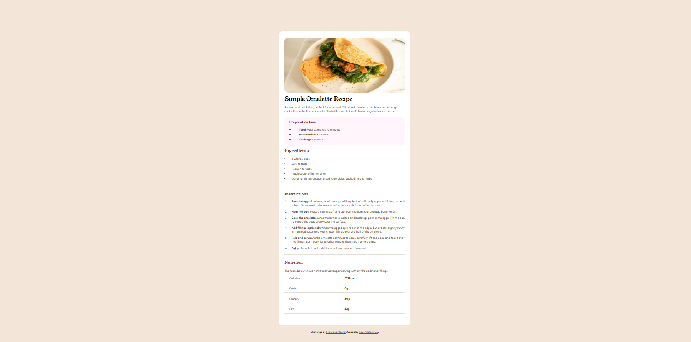

# Frontend Mentor - Recipe page solution

This is a solution to the [Recipe page challenge on Frontend Mentor](https://www.frontendmentor.io/challenges/recipe-page-KiTsR8QQKm). Frontend Mentor challenges help you improve your coding skills by building realistic projects.

## Table of contents

- [Overview](#overview)
  - [Screenshot](#screenshot)
  - [Links](#links)
- [My process](#my-process)
  - [Built with](#built-with)
  - [What I learned](#what-i-learned)
- [Author](#author)


## Overview

- This is a solution to a recipe page challenge on Frontend Mentor. It is just about designing a recipe description webpage using basic HTML and CSS elements.

### Screenshot



- You can check the hosted webpage for the mobile view.

### Links

- https://github.com/PaulAdetomiwa/recipe-page/blob/main/index.html

## My process

### Built with

- Semantic HTML5 markup
- CSS custom properties
- CSS Flexbox

### What I learned

```html
<p>
        <span id="first">Calories</span>
        <span id="second">277kcal</span>
      </p>

      <p>
        <span id="first">Carbs</span>
        <span id="second">0g</span>    
      </p>

      <p>
        <span id="first">Protein</span>
        <span id="second">20g</span>   
      </p>

      <p>
      <span id="first">Fat</span>
      <span id="second">22g</span>
      </p>
```
- I did not want to use the ```html <table> ``` tag, to make it more challenging, and it turned out well and responsive.

```css
#first {
      font-style: normal;
      width: 50%;
      text-indent: 20px;
      border-bottom: 1px solid hsl(30, 18%, 87%);
      padding: 0 0 10px 0;
      margin: 0;
    }

    #second {
      color: hsl(14, 45%, 36%); 
      font-weight: 700;
      width: 50%;
      border-bottom: 1px solid hsl(30, 18%, 87%);
      padding: 0 0 10px 0;
      margin: 0;
    }
```
- It seems repetitive, but the modification this format allows outweigh the drawback of being repetitive, which made it an easy choice for me. 

## Author

- Website - [Paul Adetomiwa](https://github.com/PaulAdetomiwa)
- Frontend Mentor - [@PaulAdetomiwa](https://www.frontendmentor.io/profile/PaulAdetomiwa)
- X - [@AdewolePaul6](https://www.x.com/AdewolePaul6)